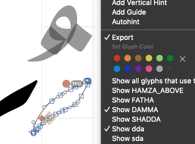

# ShowAnchorCloud
*View → Show Anchor Cloud* is a [Glyphs](https://glyphsapp.com/) plugin that displays a mark cloud for all glyphs which use the selected anchor, regardless of name. It also allows the user to filter which mark glyphs are displayed in the cloud.

## Features
Main features and differences from built-in anchor cloud support:

* Any glyph with a matching mark anchor (an anchor prefixed with underscore) will be shown in the anchor cloud.
* Anchor cloud will be shown for any non-mark anchor, regardless of the category of the glyph.
* Supports ligature anchors.
* Supports contextual anchors.
* Provides contextual anchor menu entries, to control which mark glyphs to show for the selected anchors.
* Anchor cloud will be shown for the selected anchors only.
* Anchor cloud will be shown even when outlines are also selected.

## Installation
The plugin should be installed using the built-in Plugin Manager, available from *Window → Plugin Manager*.

## Usage
* Activate with *View → Show Anchor Cloud* to use the plugin instead of Glyphs own anchor cloud.
* Right-click selected anchors to access the contextual menu and selectively control which marks to show in the anchor cloud.
